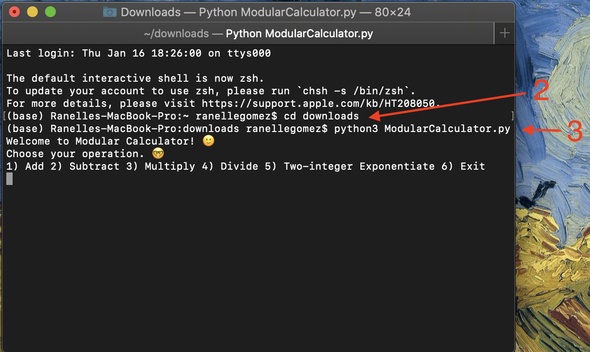

# Modular Calculator: An OOP calculator written in Python.

> "I can only dream of a calculator that uses little parts of itself to solve large problems," the unlucky soul thought before this program was written.   

---

### Table of Contents
You're sections headers will be used to reference location of destination.

- [Description](#description)
- [How To Use](#how-to-use)
- [References](#references)
- [License](#license)
- [Author Info](#author-info)

---

## Description

A simple object-oriented calculator class I built from scratch whose modular methods allow for black-box abstraction and brevity. Upon starting the program, the user is given five options: 1) Add 2) Subtract 3) Multiply 4) Divide 5) Two-integer Exponentiate 6) Exit.

#### The Design Process along with Humbling & Surprising Discoveries 

Upon writing this program, I faced many unexpected obstacles. Namely, I had issues with the input of the methods, the the maximum-recursion-depth error, input-validation techniques. 

I originally implemented two versions of exponentiate in the calculator.py class: naively named fastExponentiate() and slowExponentiate(). The former with a tail-recursive design and the latter with normal recursion given a base a case that returns the result variable once the base-case count is reached. I first tested the functions using python's built-in timer. Testing 3^n (where n is an integer), I found that for small n ranging below 1000, the tail-recursive functions was faster only by a hair. I then tried testing above 1000 to find a maximum-recursion-depth error. The override this, I added "import sys" along with " sys.setrecursionlimit(9999999)" at my own discretion, appreciating the risky nature of such a design choice. Surprisingly, I found that for large n, conventional recursion was always faster. I naively believed that the tail-recursive method would perform at constant space while the the the conventional-recursive method would perform linearly. Since python is dynamically-typedlanguage, it cannot take advantage of tail-call optimization, where there are n stack frames in conventional recursion over 1 stack frame in a tail-recursive function. 

To ultimately gaugue an optimal function for exponentiation, I wrote a seperate class which exports the runtimes of the iterative, exponential, and tail-recursive designs into a .CSV file. The program calls all three functions calculating 1 millionth to the nth power, where n is a non-negative integer from 0 to 20,000. The tail-recursive version noticably perfomed the worst in terms of time and was the least reliable by crashing before n = 20,000. Iteration was by a hair slow than conventional recursion albeit the best performer and most reliable nonetheless (since no new stack frames are opened). Thus, I chose iteration for my final design choice of two_integer_exponentiate(self, base, exponent). I included the file in the repository with the two recursive versions of exponentiation for reference. Be warned that by the nature of the tail-recursive design, it is not possible to enter negative integers. 

For test cases, I used three nested for-loops ranging from -100 to 100 to test all the functions against python's built-in math operators. All tests passed. 

#### Concepts
- Quadratic-time complexity
- Tail-recursive calls
- Object-oriented programming
- Unit testing
---

## How To Use

#### Installation
Installation is simple. 
1) Simply download the calculator.py file. 
2) CD into the folder (or address directory) where calculator.py is located. By defaut, it is likely to be in your downloads folder. On macOS, one would input the following in their terminal: "cd downloads" 
3) Input "python3 calculator.py" on the command line. The program should boot on your terminal with different calculation options along with a choice to exit. 

---

## References
http://composingprograms.com/pages/22-data-abstraction.html
https://www.cs.cornell.edu/courses/cs3110/2019sp/textbook/data/tail_recursion.html

---

## License

MIT License

Copyright (c) 2020 Ranelle Gomez

---

## Author Info

As of writing in January 2020, I am an undergraduate at UC Berkeley studying applied math and computer science. If you have any questions or comments, please reach me by the following: 1) email: ranellegomez@gmail.com 2) Text: (323) 999-4720 3)
LinkedIn: https://www.linkedin.com/in/ranellegomez/

