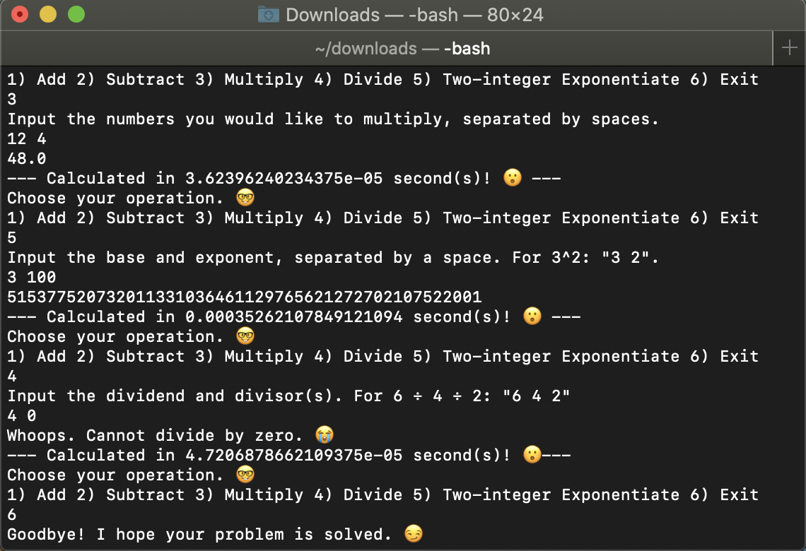

# Modular Calculator: An OOP calculator written in Python.



> "I can only dream of a calculator that uses little parts of itself to solve large problems," the unlucky soul thought before this program was written.   

---

### Table of Contents
- [Description](#description)
- [How To Use](#how-to-use)
- [References](#references)
- [License](#license)
- [Author Info](#author-info)
---

## Description

A simple object-oriented calculator class I built from scratch whose modular methods allow for black-box abstraction and brevity; some methods even call each other (higher-order functions). Upon starting the program, the user is given six options: 1) Add 2) Subtract 3) Multiply 4) Divide 5) Two-integer Exponentiate 6) Exit.

#### The design process along with humbling and surprising discoveries 

Upon writing this program, I faced many unexpected obstacles. Namely, I had issues with the input of the methods, the the maximum-recursion-depth error, and input-validation techniques. To allow for a large numbers of input, I decided on using lists as input, where list comprehension would be used to designate each nth element for its specific role. With division, for instance, the 0th element is the dividend while the rest of the elements are the divisors.  

I originally implemented two versions of exponentiate in the calculator.py class: naively named `fastExponentiate` and `slowExponentiate`, believing that Python exhausts the advantages of closing stack frames. The former written with a tail-recursive design and the latter with normal recursion both with if cases that return the resultant variable once the base-case count is reached. I first tested the functions using Python's built-in time.time. Testing 3^n (where n is an integer), I found that for small n ranging below 1000, the tail-recursive functions was faster only by a hair. I then tried testing above 1000 to find a maximum-recursion-depth error. The override this, I added "import sys" along with `sys.setrecursionlimit(9999999)` at my own discretion, appreciating the risky nature of such a design choice. Surprisingly, I found that for large n, conventional recursion was always faster. I believed that the tail-recursive method would perform at constant space while the the the conventional-recursive method would perform linearly. Since Python is a dynamically-typed language, it cannot take advantage of tail-call optimizations, where there are n stack frames in conventional recursion versus one stack frame in a tail-recursive function. 

To ultimately gaugue an optimal function for exponentiation, I wrote a seperate class which exports the runtimes of the iterative, exponential, and tail-recursive designs into a .CSV file. The program calls all three functions calculating 1 million to the nth power, where n is a non-negative integer from 0 to 20,000. The tail-recursive version noticably perfomed the worst in terms of time (lower is better) and was the least reliable by crashing before n = 19,694. Iteration was by a hair slower than conventional recursion albeit the most consistent performer and the most reliable nonetheless (since no new stack frames are opened with each iteration). Thus, I chose iteration for my final design choice of `two_integer_exponentiate`. I include the file in this repository with the two recursive versions of exponentiation for reference. Be warned that by the nature of the tail-recursive design, it is not possible to input negative integers as exponents. From testing different interpolations (i.e., exponential, linear, quadratic), quadratic runtime was clearly the best function representing the data, with R^2 values being 0.997 and higher. If you are interested in reading the data, please refer to the Google Sheets link below in references. 


For test cases, I used three nested for-loops ranging from -100 to 100 to test all the functions against Python's built-in math operators. All tests passed. 

#### Concepts
- Quadratic-time complexity
- Recursion
- Higher-order functions
- Object-oriented programming
- Unit testing
---

## How To Use

#### Installation
Installation is simple. 
1) Simply download the _calculator.py_ file. 
2) CD into the folder (or address directory) where calculator.py is located. By defaut, it is likely to be in your downloads folder. On macOS, one would input ```cd downloads``` in her terminal. 
3) Input ```python3 ModularCalculator.py``` on the command line. The program should start on your terminal with different calculation options and friendly faces along with a choice to exit. 


---

## References
https://docs.google.com/spreadsheets/d/1SDPJtvuq7mRqGGHsneOGnK42loz3wD0Z_V00y4PejME/edit?usp=sharing
http://composingprograms.com/pages/22-data-abstraction.html
https://www.cs.cornell.edu/courses/cs3110/2019sp/textbook/data/tail_recursion.html

---

## License

MIT License

Copyright (c) 2020 Ranelle Gomez

---

## Author Info

As of writing in January 2020, I am an undergraduate at UC Berkeley studying applied math and computer science. If you have any questions or comments, please reach me by the following: 1) email: ranellegomez@gmail.com 2) Text: (323) 999-4720 3)
LinkedIn: https://www.linkedin.com/in/ranellegomez/

